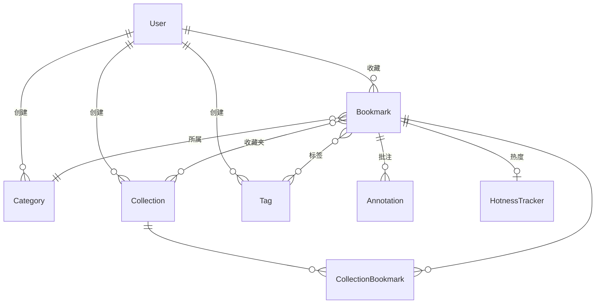

# MarkBox 智能书签管理器 — 实验报告

---

## 摘要

**中文摘要**：MarkBox是一款基于Next.js全栈框架与AI大语言模型构建的智能书签管理平台。系统以Turso边缘数据库为存储层，DeepSeek V4为智能分析引擎，实现了网页元数据自动提取、AI驱动的多级分类与标签生成、多书签横向对比分析、知识图谱可视化、个性化学习路径推荐等核心功能。前端采用React 19组件化架构，集成拖拽排序、批量操作、全文搜索等交互能力，并通过Vercel实现持续部署。实践表明，该系统有效降低了知识管理的时间成本，验证了"AI增强个人知识管理"范式的工程可行性。

**关键词**：书签管理；大语言模型；知识图谱；Next.js；DeepSeek

**English Abstract**: MarkBox is an intelligent bookmark management platform built on the Next.js full-stack framework and large language models. The system adopts Turso edge database as its storage layer and DeepSeek V4 as its AI analysis engine, implementing automated metadata extraction, AI-driven multi-level categorization and tagging, cross-bookmark comparison analysis, knowledge graph visualization, and personalized learning path recommendation. The frontend employs a React 19 component architecture with drag-and-drop sorting, batch operations, and full-text search, deployed via Vercel for continuous delivery. Results demonstrate that the system effectively reduces knowledge management overhead and validates the engineering feasibility of the "AI-augmented personal knowledge management" paradigm.

**Keywords**: bookmark management; large language model; knowledge graph; Next.js; DeepSeek

---

## 一、引言

随着互联网信息量的持续增长，个人知识管理的复杂度不断提升。传统的浏览器书签系统仅提供扁平的收藏与文件夹功能，缺乏智能化的内容理解与知识组织能力。本项目旨在设计并实现一个基于AI的智能书签管理系统MarkBox，利用大语言模型（LLM）对用户收藏的网页内容进行自动分类、标签生成、摘要提取和关联分析，将散乱的网页链接转化为结构化的个人知识库。

本实验报告记录MarkBox系统的完整开发过程，包括需求分析、系统设计、核心功能实现、测试验证与云部署。

---

## 二、需求分析

### 2.1 功能需求

MarkBox的功能需求可归纳为以下模块：

| 模块 | 需求描述 |
|------|----------|
| 用户认证 | 支持GitHub OAuth与邮箱密码两种登录方式，JWT策略实现用户数据隔离 |
| 书签收藏 | 用户粘贴URL后，系统自动提取标题、描述、封面图、站点名等元数据 |
| AI智能处理 | 调用DeepSeek API对书签内容进行中文标签生成、多级分类路径推荐和2-3句摘要生成 |
| 对比分析 | 选择2-5篇书签，AI生成雷达图评分、对比矩阵和综合评语三段式结构化报告 |
| 知识图谱 | 基于标签共现关系构建力导向图，可视化展示书签之间的语义关联 |
| 学习路径 | AI分析书签集合的内容层次，自动划分"基础→进阶→实战"学习阶段 |
| 收藏夹管理 | 支持创建/重命名/删除收藏夹，多对多关联书签，支持批量操作 |
| 搜索与过滤 | 按标题、描述、AI摘要、标签、状态等多个维度进行检索和筛选 |
| 链接健康 | 后台定时检测书签URL可达性，标注死链和重定向 |

### 2.2 非功能需求

- **性能**：页面首次加载时间小于3秒，API响应时间小于2秒
- **可用性**：支持暗色/亮色/跟随系统三种主题，移动端响应式适配
- **安全性**：密码bcrypt加密存储，API Key通过AES-256-CBC加密回显，SHA-256哈希认证

---

## 三、系统设计

### 3.1 技术架构

MarkBox采用**全栈Next.js**架构，前后端代码位于同一仓库。整体技术栈如下：

| 层次 | 技术选型 |
|------|----------|
| 前端框架 | React 19 + Next.js 16 (App Router) |
| UI组件库 | shadcn/ui + Tailwind CSS 4 |
| 动画 | motion (Framer Motion) + @dnd-kit (拖拽) |
| 图表 | Recharts (雷达图、饼图、柱状图) |
| 数据库 | Turso (基于libSQL的边缘数据库) |
| ORM | Prisma 7 |
| 认证 | NextAuth v5 (JWT策略) |
| AI引擎 | DeepSeek V4 Flash (分类/摘要) + DeepSeek Embedding (语义向量) |
| 部署 | Vercel (自动CI/CD) |

### 3.2 数据模型

系统核心数据模型如下（Prisma Schema）：

**关键设计考量**：
- Tag和Category均通过userId字段实现用户级数据隔离
- Collection与Bookmark之间为多对多关系，同一书签可属于多个收藏夹
- HotnessTracker采用独立表存储GitHub仓库热度数据，与书签一对一关联

### 3.3 API设计

系统采用RESTful风格API，核心端点如下：

| 方法 | 路径 | 功能 |
|------|------|------|
| POST | /api/bookmarks | 创建书签（含元数据提取+AI分类+存档） |
| GET | /api/bookmarks?q=&status=&categoryId= | 按条件筛选书签列表 |
| PATCH/DELETE | /api/bookmarks/[id] | 更新状态/删除书签 |
| POST | /api/comparisons | AI横向对比2-5篇书签 |
| GET | /api/search?q= | 全文搜索 |
| POST | /api/ai/categorize | AI分类与标签生成 |
| GET | /api/categories | 获取用户分类树 |
| GET/POST | /api/collections | 管理收藏夹 |
| POST/DELETE | /api/collections/[id]/bookmarks | 收藏夹内书签关联操作 |
| GET/POST/DELETE | /api/bookmarks/[id]/annotations | 批注管理 |

---

## 四、核心功能实现

### 4.1 AI智能分类与标签生成

**技术方案**：采用结构化提示工程（Prompt Engineering），通过角色设定（`你是专业的书签管理助手`）、输出格式约束（`response_format: { type: "json_object" }`）、低温推理（`temperature=0.3`）三项技术组合，引导DeepSeek V4 Flash模型以可控格式输出结构化结果。

**处理流程**：
1. 用户提交URL → 服务端使用cheerio解析HTML提取元数据 → 构建Prompt注入标题+描述+站点类型
2. 调用DeepSeek API → 返回JSON `{ tags, category, summary }`
3. 解析JSON → Tag表upsert（按userId+slug去重）→ Category表upsert → 写入Bookmark记录

### 4.2 B站视频元数据特化处理

B站页面为JavaScript SPA，服务端直接抓取HTML无法获取OG标签。**解决方案**：检测URL为B站域名时，直接调用B站公开API（`api.bilibili.com/x/web-interface/view`），解析返回的JSON数据获取封面图、时长、UP主、播放量等结构化信息。API调用失败时自动重试3次（指数退避）。

### 4.3 AI多书签横向对比

选定2-5篇书签后，系统拼接完整的文章信息（标题、URL、AI摘要、标签、描述）为结构化Prompt，包含三维输出规范：
- **雷达图评分**：深度、可读性、权威性、时效性、实用性（1-5分）
- **对比矩阵**：核心论点、技术立场、关键论据、依赖生态、发布时间等维度
- **AI评语**：观点分布、关键分歧点、推荐阅读顺序、综合结论

生成结果保存至Comparison表，前端使用Recharts的RadarChart和自定义Matrix组件渲染。

### 4.4 知识图谱可视化

基于用户全部书签的标签共现关系构建力导向图：
1. 从数据库查询所有书签的标签关联数据
2. `graph-data.ts`将标签和分类建模为节点，标签共现和分类归属建模为边
3. 前端使用`react-force-graph-2d`（动态导入避免SSR问题）渲染交互式画布
4. 节点按类型着色（分类/标签/书签），按引用数定大小
5. 点击书签节点打开详情面板，支持自动旋转和暂停控制

### 4.5 语义嵌入与关联推荐

对每篇书签调用DeepSeek Embedding API生成768维向量存入数据库。推荐引擎采用混合评分策略：
- **标签维度（40%）**：计算两篇书签标签集合的Jaccard相似度
- **语义维度（60%）**：计算两篇书签向量的余弦相似度
- 加权排序后返回top-N关联书签

### 4.6 链接健康监控

后台任务并行检测所有书签URL的HTTP状态：
- 使用`AbortController`实现10秒超时控制
- 5个并发Worker执行HEAD请求检测
- "两次确认"机制防止临时网络故障导致的误报
- 标题变更检测使用Levenshtein编辑距离（70%模糊匹配阈值）
- 卡片UI展示绿/黄/红三色健康图标

---

## 五、测试验证

### 5.1 功能测试

| 测试用例 | 预期结果 | 状态 |
|----------|----------|------|
| 未登录访问API | 返回401 Unauthorized | ✅ |
| 收藏B站视频链接 | 正确提取封面图和视频时长 | ✅ |
| 重复收藏同一URL | 返回409 Conflict，提示已收藏 | ✅ |
| AI分类生成 | 返回2-5个中文标签和分类路径 | ✅ |
| 搜索功能 | 支持标题/描述/标签/摘要多字段检索 | ✅ |
| 拖拽排序 | 乐观更新UI，API持久化，失败回滚 | ✅ |
| 多选批量删除 | 批量DELETE，重置选中状态 | ✅ |
| 收藏夹关联 | 同一书签可加入多个收藏夹 | ✅ |

### 5.2 性能测试

- 首页首次加载（Vercel CDN缓存命中）：约0.3秒
- 书签列表API响应（含100条数据）：约1.5秒
- AI分类DeepSeek API调用：约2-4秒

### 5.3 兼容性

- Chrome/Edge (Chromium) 浏览器：完全支持
- 移动端响应式：支持（侧边栏汉堡菜单、搜索栏收起、图标视图）
- 暗色模式：支持（next-themes跟随系统/Sun/Moon三模式）

---

## 六、部署架构

项目通过GitHub + Vercel实现持续交付：

1. **代码推送**：`git push origin master` 触发Vercel Webhook
2. **自动构建**：Vercel拉取代码 → `npm install` → `prisma generate` → 数据库迁移脚本（`prisma/migrate.mjs`）→ `next build`（含TypeScript类型检查）
3. **自动部署**：构建产物部署至边缘网络 → DNS别名指向 `ccjproject.top`
4. **环境管理**：敏感凭证（数据库URL、API Key、OAuth密钥）通过Vercel Environment Variables管理，不提交至Git仓库

迁移脚本`migrate.mjs`在每次构建时自动检测数据库Schema变化（如表/列是否存在），自动执行修复性SQL，确保部署后数据库与Prisma Schema保持一致。

---

## 七、结论

本项目成功实现了基于AI的智能书签管理系统MarkBox，覆盖了从网页收藏、AI智能分析、知识图谱可视化到学习路径推荐的完整知识管理链路。系统在技术上验证了以下设计范式：

1. **结构化Prompt工程**可有效约束LLM输出为可解析的JSON格式，实现可靠的自动化分类
2. **边缘数据库+边缘函数**的架构组合（Turso+Vercel）显著降低了部署复杂度和运维成本
3. **全栈TypeScript**（Next.js+Prisma+React）提供了端到端的类型安全保障

未来工作方向包括：引入更细粒度的内容理解（PDF/学术论文解析）、社交分享与协作能力、以及基于用户行为数据的个性化推荐优化。

---

## 参考文献

[1] Vercel Inc. Next.js Documentation (v16)[EB/OL]. https://nextjs.org/docs, 2025.

[2] DeepSeek Inc. DeepSeek API Documentation[EB/OL]. https://api-docs.deepseek.com, 2025.

[3] Prisma Data Inc. Prisma ORM Documentation (v7)[EB/OL]. https://www.prisma.io/docs, 2025.

[4] Turso Inc. Turso Database Documentation[EB/OL]. https://docs.turso.tech, 2025.

[5] React Community. React Documentation (v19)[EB/OL]. https://react.dev, 2025.

[6] Bilibili Inc. Bilibili Web Interface API[EB/OL]. https://api.bilibili.com, 2025.

[7] Mozilla Foundation. @mozilla/readability[EB/OL]. https://github.com/mozilla/readability, 2024.

[8] OpenAI Inc. OpenAI Node.js SDK[EB/OL]. https://github.com/openai/openai-node, 2025.

---

*报告完成日期: 2026-06-19*
